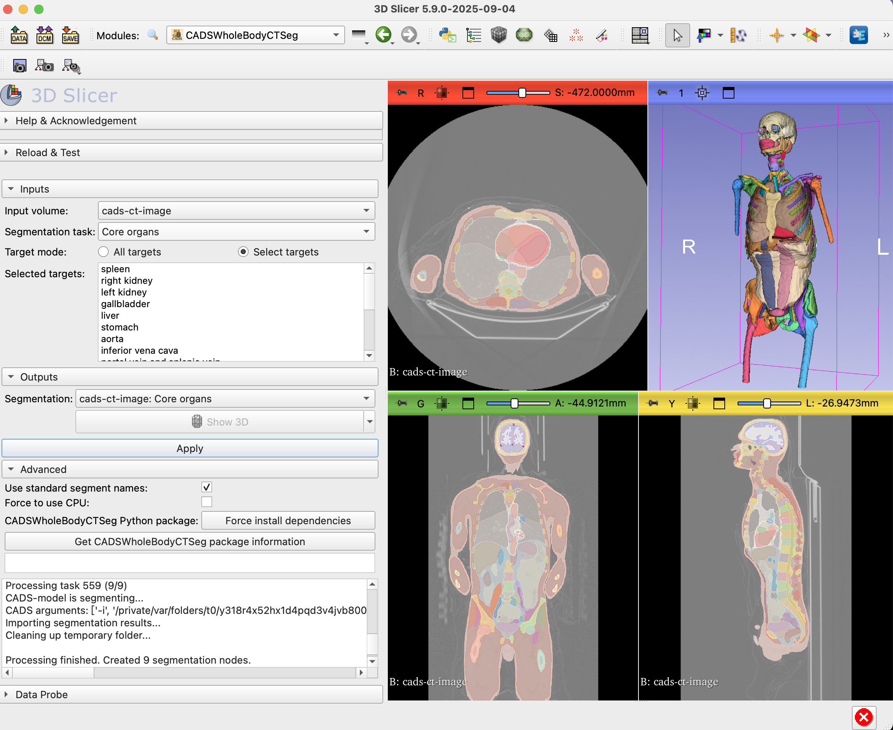

# CADS 3D Slicer Plugin
This repository contains the 3D Slicer tool for the [CADS-model](https://github.com/murong-xu/CADS).




CADS is a robust, fully automated framework for segmenting 167 anatomical structures in Computed Tomography (CT), spanning from head to knee regions across diverse anatomical systems.

The framework consists of two main components:

1. **CADS-dataset**: 
   - 22,022 CT volumes with complete annotations for 167 anatomical structures.
   - Most extensive whole-body CT dataset, exceeding current collections in both scale (18x more CT scans) and anatomical coverage (60% more distinct targets).
   - Data collected from publicly available datasets and private hospital data, spanning 100+ imaging centers across 16 countries.
   - Diverse coverage of clinical variability, protocols, and pathological conditions.
   - Built through an automated pipeline with pseudo-labeling and unsupervised quality control.

2. **CADS-model**: 
   - An open-source model suite for automated whole-body segmentation.
   - Performance validated on both public challenges and real-world hospital cohorts.
   - Available as Python script run (this GitHub repo) for flexible command-line usage.
   - Also available as a user-friendly 3D Slicer plugin with UI interface, simple installation and one-click inference.

## Useful Links
- [📄 CADS Paper Preprint](https://arxiv.org/abs/2507.22953)
- [🤗 CADS-dataset](https://huggingface.co/datasets/mrmrx/CADS-dataset)
- [📦 CADS-model Weights](https://github.com/murong-xu/CADS/releases/tag/cads-model_v1.0.0)
- [🔧 CADS-model Codebase](https://github.com/murong-xu/CADS)
- [🛠 CADS-model 3D Slicer Plugin](https://github.com/murong-xu/SlicerCADS)

If you use this software and find this work useful, please cite:

```bibtex
@article{xu2025cads,
  title={CADS: A Comprehensive Anatomical Dataset and Segmentation for Whole-Body Anatomy in Computed Tomography},
  author={Xu, Murong and Amiranashvili, Tamaz and Navarro, Fernando and Fritsak, Maksym and Hamamci, Ibrahim Ethem and Shit, Suprosanna and Wittmann, Bastian and Er, Sezgin and Christ, Sebastian M. and de la Rosa, Ezequiel and Deseoe, Julian and Graf, Robert and Möller, Hendrik and Sekuboyina, Anjany and Peeken, Jan C. and Becker, Sven and Baldini, Giulia and Haubold, Johannes and Nensa, Felix and Hosch, René and Mirajkar, Nikhil and Khalid, Saad and Zachow, Stefan and Weber, Marc-André and Langs, Georg and Wasserthal, Jakob and Ozdemir, Mehmet Kemal and Fedorov, Andrey and Kikinis, Ron and Tanadini-Lang, Stephanie and Kirschke, Jan S. and Combs, Stephanie E. and Menze, Bjoern},
  journal={arXiv preprint arXiv:2507.22953},
  year={2025}
}
```

## Installation
1. **Install 3D Slicer**  
   Download and install the latest version of [3D Slicer](https://download.slicer.org/).  
   Compatibility note (verified on September 5, 2025): Our extension has been tested with preview release **5.9.0**.

2. **Install PyTorch**  
   Slicer makes it easy to set up the correct PyTorch version:  
   - Open `Extension Manager` in Slicer → search for `PyTorch` → click `Install`.  
     (Slicer will ask you to restart after installation.)  
   - After restarting, go to the `PyTorch Utils` module.  
     In the `Torch version requirement` box, type `<2.6`, then click `Install PyTorch`. A PyTorch version (>= 2.0.0 and <2.6.0) compatible with your machine should be installed.

3. **Install CADS Extension**  
   - ~~Open `Extension Manager` → search for `CADS` → click `Install`.
     (Again, restart Slicer after installation.)~~
   - ~~Once restarted, open the `CADS` module in Slicer and you should see the CADS user interface ready to use.~~

   🚧 **In progress**: Installing CADS directly through the 3D Slicer Extension Manager is in progress and will be available soon!  

   In the meantime, please use the manual installation described below:

   - Clone this repository to your machine: 
      - `git clone git@github.com:murong-xu/SlicerCADS.git`
      - Or simply download it from https://github.com/murong-xu/SlicerCADS
   - Tell Slicer where to find it:
      - Open 3D Slicer
      - Go to `Edit`(the very top-left corner) → `Application Settings` → `Modules`.
      - Under `Additional module paths`, click the `arrow` on the right, then hit `Add`.
      - Navigate to the **SlicerCADS** folder you just downloaded, open it, and select the **CADS** subfolder.
      - Press OK and restart Slicer.
   - Once restarted, open the `CADS` module in Slicer and you should see the user interface ready to use.

## Quick Start
1. **Open the CADS extension** in 3D Slicer.  
2. **Load your CT image file.**  
3. **Set the input parameters:**  
   - `Input volume`: The CT image you want to segment.  
   - `Segmentation task`: Choose a specific task from the dropdown menu (the targets for each task will be displayed in the UI), or select **All** to run every task in sequence.  
   - `Target mode`: 
     - `All targets`: Generate a complete segmentation for the chosen task.  
     - `Select targets`: Pick only the structures you want from the list below.  
   - `Advanced options`: 
     - `Use standard segment names` (default: *Yes*): Displays segmentation results using SNOMED-CT terminology.  
     - `Force to use CPU` (default: *No*): Runs inference on CPU if you don’t have a GPU. (Note: CPU is slower and will take longer.)  
     - `CADS Python package`:  
       - `Force install dependencies`: Re-installs the CADS package.  
       - `Get package information`: Shows the current CADS package version.  
4. **Run**: Click `Apply`, the CADS-model will begin segmenting your CT scan.  
5. **View the results:**  
   - Once finished, the results will appear automatically. You can then go to the `Data` tab to view the list of structures.
   - You can view the segmentations in the three orthogonal 2D views, or drag them into the 3D viewer.  
   - Hovering over a structure name will show detailed structure information in SNOMED-CT terminology.  

## Target Structures in Each Task
Each task represents a specific anatomical group.

**Task - Core organs**:
Spleen, Kidney R/L, Gallbladder, Liver, Stomach, Aorta, Inferior vena cava, Portal and splenic veins, Pancreas, Adrenal glands R/L, Upper/Lower lobes of left lung, Upper/Middle/Lower lobes of right lung.

**Task - Spine complete**:
Vertebrae C1-C7, T1-T12, L1-L5.

**Task - Heart & vessels**:
Esophagus, Trachea, Myocardium, Heart atrium R/L, Heart ventricle R/L, Pulmonary artery, Brain, Common iliac artery R/L, Common iliac vein R/L, Small intestine, Duodenum, Colon, Urinary bladder, Face.

**Task - Trunk muscles**:
Humerus R/L, Scapula R/L, Clavicle R/L, Femur R/L, Hip R/L, Sacrum, Gluteus maximus/medius/minimus muscles R/L, Deep muscle of back R/L, Iliopsoas muscle R/L.

**Task - Ribs complete**:
Ribs 1-12 R/L.

**Task - RT risk organs**:
Spinal canal, Larynx, Heart, Colostomy bag, Sigmoid colon, Rectum, Prostate, Seminal vesicle, Mammary gland R/L, Sternum, Psoas major muscle R/L, Rectus abdominis muscle R/L.

**Task - Brain tissues**:
White matter, Gray matter, Cerebrospinal fluid, Scalp, Eyeballs, Compact bone, Spongy bone, Blood, Muscle of head.

**Task - Head-neck organs**:
Carotid artery R/L, Arytenoid cartilage, Mandible, Brainstem, Buccal mucosa, Oral cavity, Cochlear R/L, Cricopharyngeus, Cervical esophagus, Anterior/Posterior eyeball segment R/L, Lacrimal gland R/L, Submandibular gland R/L, Thyroid, Glottis, Supraglottis, Both lips, Optic chiasm, Optic nerve R/L, Parotid gland R/L, Pituitary gland.

**Task - Body regions**:
Subcutaneous tissue, Muscle, Abdominal cavity, Thoracic cavity, Bones, Gland structure, Pericardium, Prosthetic breast implant, Mediastinum, Spinal cord.

## License

- **Codebase** (the `cads` package and all source code in this repository) is licensed under the [Apache License 2.0](LICENSE).  
- **Model weights** released in the [Releases](https://github.com/murong-xu/CADS/releases) section are licensed under [CC BY 4.0](MODEL_LICENSE).  

## Troubleshooting
**CUDA Memory Error (torch.OutOfMemoryError)** 

Even though we designed the model to automatically manage available GPU/CPU resources during prediction, you may still run into out-of-memory errors. This usually happens if:
1. Your GPU has very limited VRAM (e.g., around 4 GB), or
2. The input CT image is large.

In these cases, we recommend switching to `Force to use CPU` mode. It will be slower than GPU (CPU-only needs around 10+ minutes for a chest+abdomen CT), but it will run more reliably and avoid memory issues.


## Contact
If you encounter any issues or have suggestions, please open an issue in this GitHub repository.  

We truly appreciate your feedback and ideas, it helps us make the project better!  